# Execution Agent — Guided Tour

> No presenter needed. This document walks you through a full trade cycle from submission to dispatch.  
> Run the app locally and follow along — see [README.md](README.md) for startup instructions.

---

## What this tool demonstrates

Execution desks face a problem that has two distinct halves. The strategic half — *when* to trade, *what* algorithm to use, *how* to slice an order — involves qualitative reasoning under uncertainty. The quantitative half — *exactly* what that strategy will cost in slippage, fill price, and market impact — is deterministic math that an LLM has no business doing.

This tool enforces that boundary architecturally. The LLM decides strategy. A C++20 order book engine, running through a pybind11 bridge with the Python GIL released, computes the numbers. A LangGraph graph orchestrates both and pauses mid-run for the trader to review before a single order is dispatched.

---

## 1. The Trade Dashboard

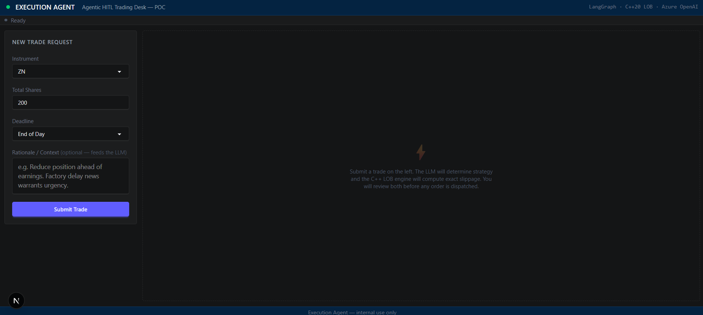

The dashboard opens with the trade submission form prefilled with a sensible default — ZN, 200 contracts, end-of-day deadline. There is nothing to configure before use — no sessions, no accounts, no setup steps. Select an instrument from the grouped dropdown (equities, rates futures, equity index futures, commodities, FX), set the quantity and deadline, add an optional rationale, and click **Submit Trade**.

The rationale field is forwarded verbatim to the LLM as context for strategy selection — it is where you communicate the *why* behind the trade ("macro catalyst", "rebalance before close", "risk-off on factory data"). If left blank, the system constructs a default prompt from the form values.

Once submitted, the form transitions to a loading state. Behind the scenes:

1. `POST /api/trade` is called with the form payload
2. LangGraph starts the `strategy_node` — the LLM call begins
3. Once the LLM returns, `simulation_node` calls the C++ LOB engine
4. The graph hits `hitl_node`, checkpoints its entire state to SQLite, and returns
5. The frontend's polling loop detects the paused state and renders the HITL panel

The LLM call takes 3–8 seconds. The C++ simulation takes under a microsecond. The loading indicator is entirely the LLM.

---

## 2. Loading — LLM Running

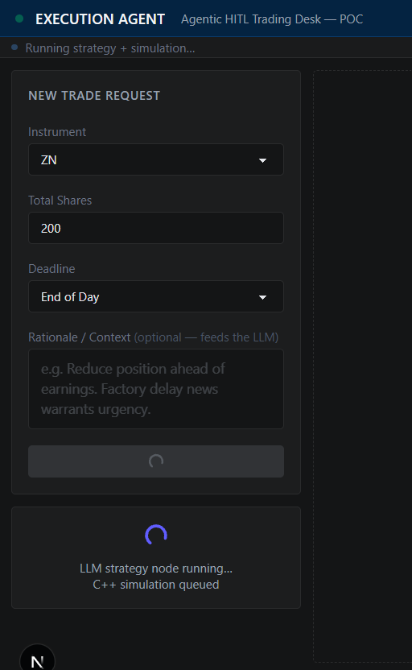

While the strategy node is running, the dashboard shows a pending state. This is the only moment in the cycle with meaningful latency — the LLM is reasoning about the trade, formulating an algorithm, and structuring its output into validated JSON via Pydantic.

Once the LLM completes and the C++ simulation runs (sub-microsecond), the HITL panel loads.

---

## 3. The HITL Review Panel

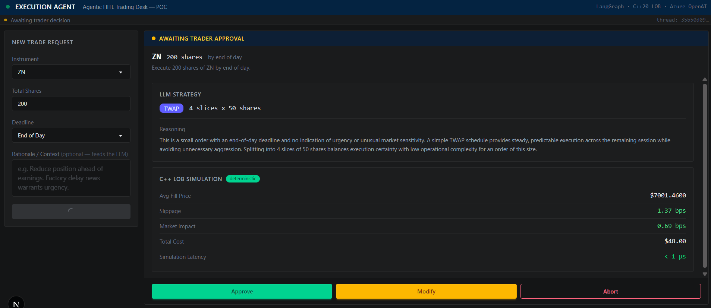

The HITL panel is the core of the application. It surfaces two independent analyses simultaneously and asks the trader to act on them.

The left side is the LLM's output. The right side is the C++ engine's output. They were computed independently — the LLM decided the *approach*, the C++ computed the *consequences of that approach*.

Three actions are available: **Approve**, **Modify**, or **Abort**. The graph waits in this state indefinitely — it is checkpointed to SQLite and will hold until resumed.

---

## 4. Strategy Card — LLM Output

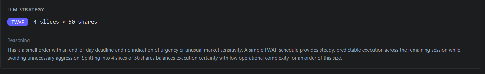

The strategy card shows what the LLM decided:

- **Algorithm** — VWAP, TWAP, Sweep, or Iceberg, selected based on the order size, deadline, and rationale
- **Number of slices** — how many child orders to break the parent into
- **Shares per slice** — size of each child order
- **Reasoning** — plain-language explanation of why the LLM made these choices

The reasoning field is not decorative. It is the LLM's self-assessment: what factors it weighted, what risks it identified, why this algorithm fits the stated constraints. An experienced trader reading it can immediately tell whether the LLM understood the situation or missed something.

The LLM does not compute slippage or fill prices. It has no knowledge of the current order book. It decides strategy. That is the entire scope of its role.

---

## 5. Metrics Card — C++ Engine Output

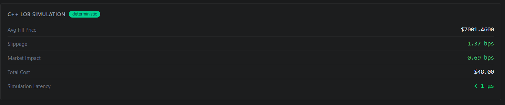

The metrics card shows what the C++ LOB engine computed by sweeping the real ZN order book with the LLM's strategy parameters:

| Metric | Description |
|---|---|
| Avg fill price | Volume-weighted average across all swept price levels |
| Slippage (bps) | Basis points above the arrival price — colour-coded green / amber / red |
| Market impact (bps) | Half-spread model estimate |
| Total cost (USD) | Dollar cost of slippage across the full order |
| Simulation latency | Elapsed time inside `ExecutionSimulator::simulate()` |

The simulation latency is the point. Benchmarked at **p50 = 0.6 µs, p99 = 1.1 µs** across 100,000 iterations on a modern desktop (run `python benchmark_simulate.py` to reproduce). This is not a Python estimate — it is a compiled C++20 engine running in a native thread with the Python GIL released, sweeping a pre-allocated order book via an intrusive index list with zero heap allocation on the hot path.

Slippage is colour-coded to make the decision visible at a glance: green is low impact, amber warrants scrutiny, red means the current parameters will be expensive and the trader should consider modifying before approving.

---

## 6. Approving the Trade

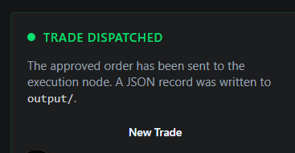

If the slippage is acceptable and the strategy looks right, click **Approve**.

The graph resumes at `execution_node`, logs the trade, and writes a JSON record to `output/`. The dashboard transitions to the completed state showing a confirmation and a summary of the approved parameters.

The output file captures the full trade record:

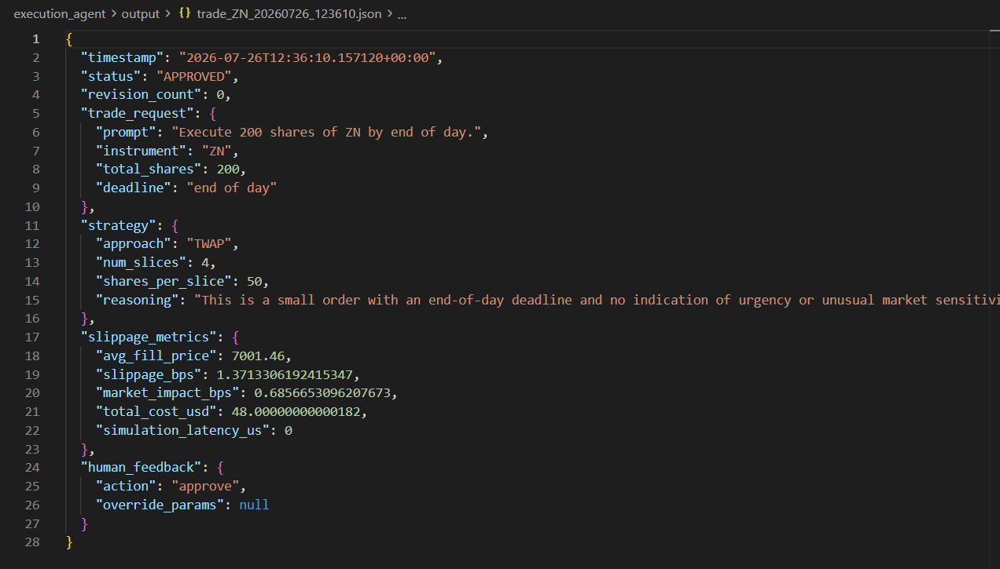

The JSON includes the `thread_id` for correlation, the full LLM strategy, all C++ metrics, the approved status, and a timestamp. Every approved trade produces a file in `output/` — gitignored, but available locally for audit.

---

## 7. Modifying Before Approval

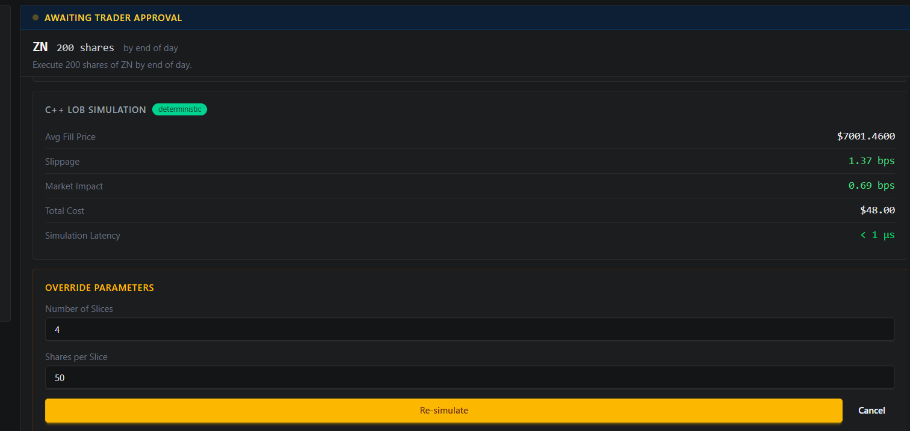

If slippage is amber and the trader wants to reduce aggression, click **Modify**.

The override form expands inline with controls for `num_slices` and `shares_per_slice`. The trader adjusts the parameters — more slices, smaller size per slice — and clicks **Re-run Simulation**.

The frontend sends `{"action": "revise", "override_params": {...}}` to `/api/resume/{thread_id}`. The graph resumes at `simulation_node` with the overridden parameters, runs the C++ sweep again, and pauses at `hitl_node` a second time.

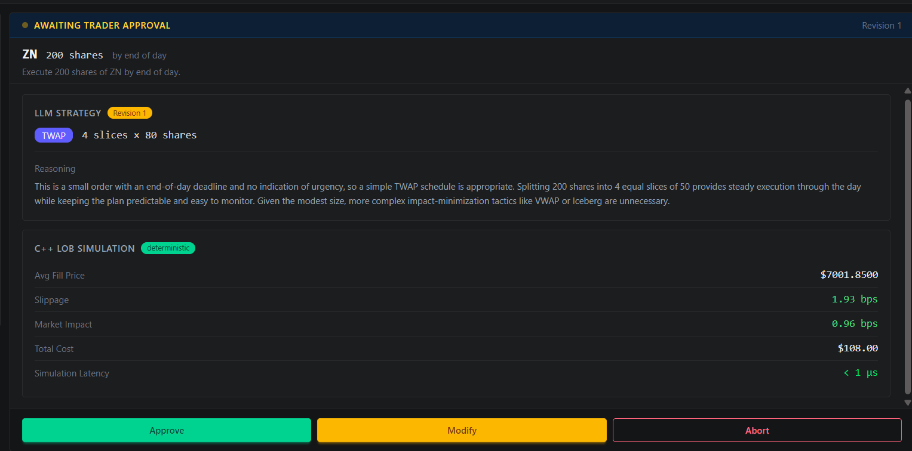

The Metrics Card refreshes with the new numbers. Slippage drops because the individual sweeps are smaller. The trader reviews the updated metrics and approves.

---

## 8. The Abort Path

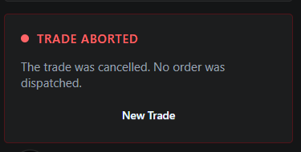

If conditions change while the trade is under review — news already priced in, risk limits revised — click **Abort**.

The graph routes to the terminal node. No order is dispatched, no output file is written. The dashboard shows a clean cancellation confirmation.

The full graph state — including the LLM strategy and C++ metrics that were computed before the abort — remains in the SQLite checkpoint for auditability. The trade can be reviewed after the fact even though it was never executed.

---

## 9. Terminal — Pipeline and C++ Logs

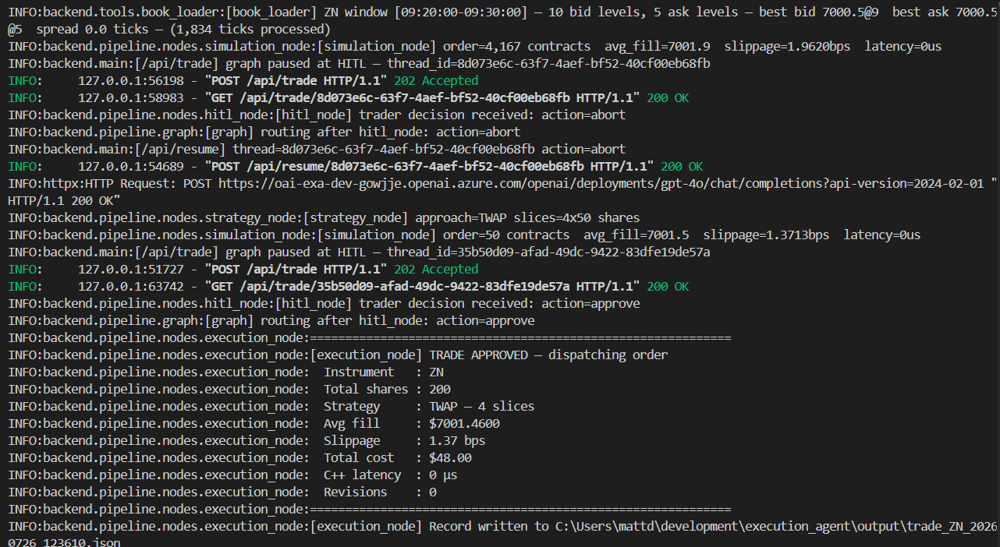

The backend terminal shows two complete trade cycles back to back. The first ends with `action=abort` — the graph routed cleanly to the terminal node with nothing dispatched. The second ends with `action=approve` and the full `execution_node` summary block:

```
Instrument  : ZN
Strategy    : TWAP — 4 slices
Avg fill    : $7001.4600
Slippage    : 1.37 bps
Total cost  : $48.00
C++ latency : 0 µs
```

The `0 µs` per-call latency is below `std::chrono::high_resolution_clock`'s resolution — the sweep finishes before the clock can register a tick. Run `python benchmark_simulate.py` for the full picture: **p50 = 0.6 µs, p99 = 1.1 µs** across 100,000 iterations. That is the production-grade claim: not a single fast run, but a consistent sub-microsecond distribution. The GIL was released, the engine ran natively, and zero heap allocation occurred on the hot path.

The book loader line at the top confirms the real ZN data is being used: `10 bid levels, 5 ask levels — spread 0.0 ticks` (a locked market — best bid equals best ask — which is a valid condition in a reconstructed book and produces realistic near-zero spread slippage).

---

## Notes for reviewers

**Suggested demo trade:** `ZN`, 200 contracts, `EOD`, rationale: `factory delay news — reducing duration exposure before close`. This exercises the full pipeline and typically produces VWAP or TWAP with 3–8 bps slippage on the real Bloomberg book.

**What to focus on:**

- The HITL panel — both cards should load simultaneously. Strategy is from the LLM. Metrics are from C++. Neither system crossed the boundary into the other's domain.
- The simulation latency in the Metrics Card — sub-microsecond confirms the GIL was released and the C++ ran natively.
- Click **Modify**, reduce the slice size, and re-run. Watch slippage drop. This is the LOB sweep recomputing with a different order size against the same real market data.

**What this tool is not (yet):**

- It does not connect to a live OMS or order routing system — `execution_node` is a POC stub that logs and writes JSON
- The order book is a snapshot reconstructed from a 2016 Bloomberg tick file — not a live feed
- SSE streaming of LLM reasoning tokens to the frontend is scoped for Phase 6
- The frontend is single-session — concurrent trades on the same browser tab are not supported in the current POC
